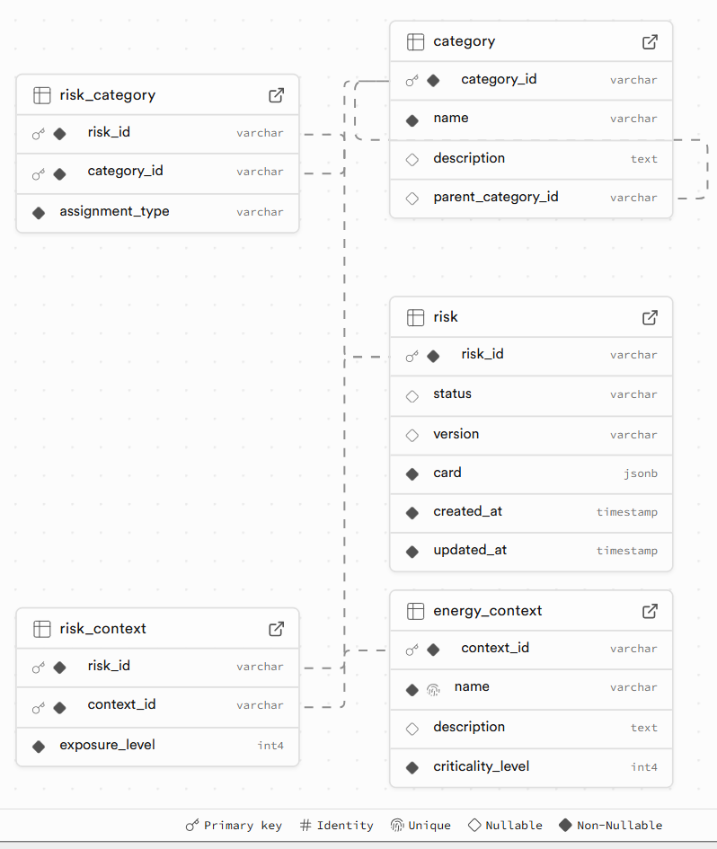

# EnergyGuard AI Risk Database

The EnergyGuard AI Risk Database of Task 5.4 is a curated database and API exposing canonical AI risk cards for energy-sector assessments. It provides a Postgres-backed data model with JSONB risk cards, FastAPI-powered services, CLI tooling for editorial workflows, and daily JSON/CSV exports suitable for TEF/ALTAI integration. The current schema of the database can be visualised below: 

<p align="center">
  
</p>

Each `risk.card` JSONB object contains these top-level fields:

- `risk_name`, `description`
- `ai_model_type` (list), `probability_level`, `impact_level`, `impact_dimensions` (list)
- `trigger_conditions`, `technological_dependencies` (list), `known_mitigations` (list)
- `regulatory_requirements` (list), `operational_priority`
- `source_reference` (list), `provenance` (list of objects)
- `related_risks` (list), `categories` (list), `energy_context` (list)
- `altai_requirements` (list)
- `version`, `stable_id`, `merge_hash`, `lifecycle_stage`, `risk_summary`


## Features

- **Relational schema + JSONB cards** with automated `updated_at` trigger and GIN index for search.
- **REST API** for listing, filtering, and managing risk cards with optional API token security (including lifecycle/category filters).
- **CSV importer + linter** that normalises vocabularies, validates canonical IDs (MITRE ATLAS / MIT AI Risk / AIID), and enforces structured provenance.
- **Editorial utilities** for quarterly review feeds, provenance stamping, and lifecycle tagging.
- **Automated exports** that persist daily JSON/CSV snapshots with 14-day retention.
- **TEF/ALTAI hooks** including stable IDs, brief listings, and batch fetch support.

License: [MIT](LICENSE)

## Project Structure

```
app/
  api/                FastAPI routers and dependencies
  cli/                Typer commands for ingestion and review
  core/               Settings and configuration helpers
  db/                 SQLAlchemy models, sessions, and init helpers
  schemas/            Pydantic models for validation and responses
  services/           Business logic, exports, and risk services
exports/              Default export directory (mounted in containers)
seed_canonical_risks.csv  Curated 24-card seed set
```

## Prerequisites

- Python 3.11+
- Docker (for containerized setup)
- Postgres 15+ (if running locally without Docker)

## Local Development

1. **Create a virtual environment and install dependencies**
   ```bash
   python -m venv .venv
   source .venv/bin/activate
   pip install -r requirements.txt  # pinned versions for reproducibility
   ```

2. **Configure environment**s
   ```bash
   cp .env.example .env
   # set POSTGRES_PASSWORD and update DATABASE_URL, API_TOKEN, PROVENANCE_EDITOR as needed
   ```

3. **Provision the database schema**
   ```bash
   python -m app.db.init_db
   ```

4. **Run the API**
   ```bash
   uvicorn app.main:app --reload
   ```

   The interactive OpenAPI documentation is available at [http://localhost:8000/docs](http://localhost:8000/docs).

## Docker Compose

A complete stack (Postgres + API) is defined via Docker Compose.

```bash
docker compose up --build
```

- API service: <http://localhost:8000>
- Postgres: exposed on port `5432`. Set `POSTGRES_PASSWORD` (and optionally `POSTGRES_USER`/`POSTGRES_DB`) in your `.env` before
  running `docker compose`.
- TODO: Exports are written to `./exports` and refreshed daily by the in-app scheduler.

## Seeding Canonical Risks

The repository includes `seed_canonical_risks.csv` covering 24 indicative canonical risks aggregated from MITRE ATLAS, MIT AI Risk, and AIID. Ingest with the Typer CLI:

```bash
python manage.py ingest canonical-seed --file seed_canonical_risks.csv
```

Inside Docker Compose, run the same ingest in the api container:

```bash
docker compose exec api python manage.py ingest canonical-seed --file /app/seed_canonical_risks.csv
```
- **When running on the host:** execute the command from your activated virtual environment after installing dependencies.

If you only need the ingestion CLI on the host, the minimal packages are:

```bash
pip install typer==0.20.0 SQLAlchemy==2.0.44 psycopg2-binary==2.9.11 pydantic==2.12.3 pydantic-settings==2.11.0 python-dotenv==1.2.1 PyYAML==6.0.3
```

(Installing the full `requirements.txt` set is still recommended for a consistent environment, but the above suffices for `python manage.py` commands.)

Validate a file without touching the database (remember to change DATABASE_URL to localhost in .env):

```bash
python manage.py lint --file seed_canonical_risks.csv
```

The importer (and linter) normalises and enforces:

- `EG-R-\d{4,}` risk ID pattern.
- Probability/impact/operational priority levels between 1 and 5.
- Controlled vocabularies for `impact_dimensions`, `categories`, and `energy_context` (see table below).
- Regulation tokens converted to canonical codes (e.g., `EU-AI-Act-Art14`, `NERC-CIP-013`).
- Source IDs verified against MITRE ATLAS, MIT AI Risk, and AIID lists (unknown codes raise lint errors).
- Provenance captured as structured objects (e.g., `{"action":"merged","sources":["MITRE_ATLAS:AML.T0043"],"editor":"ICCS"}`).
- Automatic derivation of `lifecycle_stage` and `risk_summary`.
- Deterministic merges using the normalised title/description hash (`merge_hash`) so repeated ingests remain idempotent.

### Energy Context Vocabulary (To be updated)

```
generation_renewables     Solar, wind, hydro, or other renewable generation assets.
generation_conventional   Thermal, nuclear, or fossil-based power plants.
transmission_control      Transmission network operations, substations, relay protection.
distribution_operations   Distribution management systems, outage restoration, voltage regulation.
market_operations         Trading, dispatch optimisation, balancing markets, price forecasting.
demand_response           Flexibility management, DR aggregators, prosumer participation.
retail_energy             Customer-facing services, billing, personalisation, demand prediction.
enterprise_it             Back-office AI (HR, cybersecurity, procurement, document processing).
asset_management          Predictive maintenance, inspection drones, fault detection.
public_affairs            External communications, regulator transparency, explainability obligations.
legal_affairs             Compliance tracking, documentation, regulatory submissions.
supply_chain              Vendor data, model sourcing, third-party dependencies.
control_rooms             Real-time supervision, operator decision support, human-AI teaming.
transmission_planning     Grid expansion, capacity planning, load flow simulations.
distributed_generation    DER forecasting, microgrids, virtual power plants.
substation_security       Physical/digital security, surveillance analytics.
```
### Editorial Review Feed

Identify gaps for quarterly curation cycles:

```bash
python manage.py review feed > review_gaps.csv
```

Inside Docker Compose (writes to host):

```bash
docker compose exec api sh -c "python manage.py review feed" > review_gaps.csv
```

This CSV lists risk cards missing `known_mitigations`, `source_reference`, or level scores to support follow-up edits.

## API Overview

### List and Search Risks

```bash
curl "http://localhost:8000/risks?q=forecast&min_impact=4&limit=20"
```

Supports free-text search over card content, minimum impact filters, exact category filtering (`?category=governance.oversight`), lifecycle filtering (`?lifecycle_stage=training`), ALTAI filtering (`?altai=robustness`), and `ids=EG-R-0001,EG-R-0005` batching for TEF integrations.

### Retrieve a Single Risk

```bash
curl http://localhost:8000/risks/EG-R-0007
```

### Create / Update / Patch (with optional API token)

```bash
curl -X POST http://localhost:8000/risks \ 
  -H "Content-Type: application/json" \ 
  -H "X-API-Key: <token>" \ 
  -d @new_risk.json
```

(`new_risk.json` contains a full example payload you can clone/modify for new submissions.)

`POST`, `PUT`, and `PATCH` endpoints append provenance entries documenting editor, action, and timestamp; responses expose `card.lifecycle_stage` and `card.risk_summary` for UI rendering.

### Export Endpoints

- `GET /export/json` – JSON dump of all risks.
- `GET /export/csv` – Flattened CSV (arrays joined by `;`).

Daily background jobs also write `exports/eg_risks.json`, `exports/eg_risks.csv`, and timestamped snapshots retained for 14 days.

### Provenance Crosswalk

- Mapping data comes from IBM’s Risk Atlas Nexus SSSOM files (e.g., `mit-ai-risk-repository_ibm-risk-atlas_from_tsv_data.yaml` and `ibm2nistgenai_from_tsv_data.yaml`).
- Refresh the cached mappings with:
  ```bash
  python scripts/update_risk_atlas_mappings.py
  ```
  or set `REFRESH_RISK_ATLAS_NEXUS=true` before running the importer to force a download on ingest.
- When a risk title matches an `atlas-*` entry, the importer appends a provenance object to `card.provenance` like:
  ```json
  {
    "action": "mapped",
    "sources": ["IBM_RISK_ATLAS:atlas-data-poisoning"],
    "nexus_matches": ["mit-ai-risk-subdomain-2.2"],
    "nist_controls": ["NIST-XYZ"],
    "mitre_atlas": ["AML.T0020"]
  }
  ```
### TEF / ALTAI Hooks

- Every card exposes `stable_id == risk_id` for UI clarity.
- `GET /risks/brief` returns `risk_id`, `risk_name`, `impact_level`, and `impact_dimensions` for dropdown population.
- `GET /risks?ids=...` enables batch retrieval for TEF forms.
- TEF forms can persist `risk_id` references and retrieve full context via `GET /risks/{risk_id}`.

## Security

Set `API_TOKEN` (or `X-API-Key` header) to require authentication on mutating endpoints. Missing or incorrect tokens result in `401 Unauthorized`. Provenance entries capture editor/timestamp metadata for governance reporting.

### GitHub Secrets (CI/CD)

If you run automated deployments or scheduled ingests from GitHub Actions, add the required environment variables as [repository secrets](https://docs.github.com/en/actions/security-guides/using-secrets-in-github-actions) instead of committing them.

| Secret name | Description | Example value* |
| --- | --- | --- |
| `POSTGRES_USER` | Database role used by the API and import jobs. | `energy_guard_app` |
| `POSTGRES_PASSWORD` | Strong password for `POSTGRES_USER`. | `generate-a-32-char-random-string` |
| `POSTGRES_DB` | Database name for the EnergyGuard schema. | `energy_guard` |
| `POSTGRES_HOST` *(optional)* | Hostname of the Postgres service (defaults to `localhost`). | `db` |
| `POSTGRES_PORT` *(optional)* | Port for the Postgres service (defaults to `5432`). | `5432` |
| `DATABASE_URL` | Full SQLAlchemy connection string referencing the same credentials. | `postgresql+psycopg2://energy_guard_app:${{ secrets.POSTGRES_PASSWORD }}@db:5432/energy_guard` |
| `API_TOKEN` *(optional)* | Token required for POST/PUT/PATCH requests when API key enforcement is enabled. | `use-a-unique-token-for-ci` |
| `PROVENANCE_EDITOR` | Short code recorded in provenance trails for automated edits. | `ICCS-AUTOMATION` |
| `PROVENANCE_DOMAIN` *(optional)* | Domain or organization label for provenance. | `ICCS` |

\*Replace example placeholders with real, project-specific values before use. Avoid copying these samples verbatim into production systems.

Reference the secrets inside workflow files using `${{ secrets.NAME }}` to keep credentials out of version control. Populate your runtime `.env` from the same secrets during deployment so that local `.env.example` placeholders never leak into logs or artifacts.

## Provenance & Merge Policy

- **One risk concept per card:** the importer merges rows that share a normalized title/description hash to keep canonical cards unique.
- **Structured provenance:** every card stores an array of provenance objects documenting source identifiers, editors, timestamps, and merge actions.
- **Source references:** MITRE ATLAS, MIT AI Risk, AIID, and other canonical IDs are aggregated into `card.source_reference` for downstream consumers.
- **IBM Risk Atlas Nexus crosswalk:** canonical risk names are matched against the [risk-atlas-nexus](https://github.com/IBM/risk-atlas-nexus/tree/main/src/risk_atlas_nexus/data/knowledge_graph/mappings) mappings; when a match is found the importer appends an automatic provenance entry (the importer will fetch and cache the mappings in `data/risk_atlas_nexus_mappings.json` automatically, or you can refresh manually with `python scripts/update_risk_atlas_mappings.py`). Set `REFRESH_RISK_ATLAS_NEXUS=true` before running `python manage.py ingest ...` if you want to force a fresh download; otherwise the cached JSON is used.

## Exports & Persistence

- Exports write to `/exports` (configurable) and persist across container restarts when mounted.
- Timestamped daily exports (`eg_risks_YYYYMMDD.json/csv`) are pruned after 14 days.

## Running Tests (TODO)

```bash
pytest
```

## TODOs
- Schema will be constantly evolved based on the needs...
- Create a user friendly front-end to explore the database and add risks as a stakeholder. The front-end should be in accordance with the main template of the EnergyGuard platform.
- Map to the acceptance environment of T5.2 as follows: Create a matchmaking service (maybe LLM based) that based on the type of AI application tested by the client displays the appropriate risks and alerts for their specific type of AI system.
- Pytests
- Database should be public. It can only be modified by EnergyGuard admins though.

## License

Released under the MIT license. See [LICENSE](LICENSE) for details.
